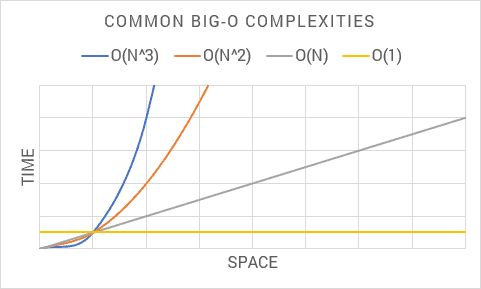
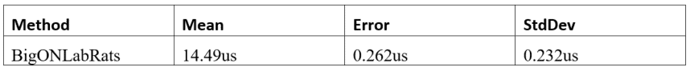
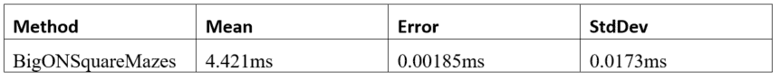
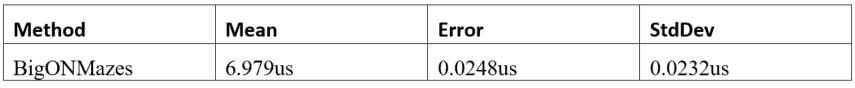
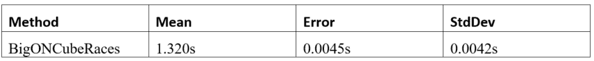
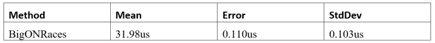
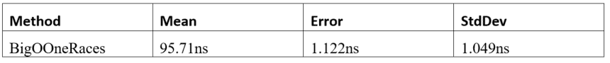

# Tackle Big-O Notation in .NET Core
Performance sensitive code is often overlooked in business apps. This is because high-performance code might not affect outcomes. Concerns with execution times are ignorable if the code finishes in a reasonable time. Apps either meet expectations or not, and performance issues can go undetected. Devs, for the most part, care about business outcomes and performance is the outlier. When response times cross an arbitrary line, everything flips to less than desirable or unacceptable.

Luckily, the Big-O notation attempts to approach this problem in a general way. This focuses both on outcomes and the algorithm. Big-O notation attempts to conceptualize algorithm complexity without laborious performance tuning.

In this take, I'll delve into Big-O notation and how to apply this in .NET. I'll begin with theory found in intro to computer programing courses. Then, dive into examples based on real-world code. In the end, this guides through the creative process of writing algorithms that use sound theory.

I'll stick with proven tools such as [.NET Core 3.1.100](https://dotnet.microsoft.com/download/dotnet-core/3.1), the recommended LTS version for now. Code samples can run in the latest version of Visual Studio 2019. I'll add BenchmarkDotNet to the project to verify execution times. This makes undetectable performance issues visible. You can download the sample code from [GitHub](https://github.com/beautifulcoder/TackleBigONetCore).

Feel free to follow along, to fire up a new project with the CLI do:

```
dotnet new console
```

Be sure to do this inside of a project folder such as _TackleBigONetCore_. This same step is possible in Visual Studio. Because I do not wish to put you through a click hunt, I'll stick to the CLI.

```
dotnet add package BenchmarkDotNet --version 0.12.0
```

Before I lay down a single line of code, it is best to start with theory.

# What Is Big-O Notation?

The Big-O notation measures the worst-case complexity of an algorithm. The algorithm works on data input of any size. For a given _n_, it answers the question: “What happens as n approaches infinity?” This helps to analyze the effectiveness of an algorithm which can be measured in time and space. Think of time as the execution time, and space as the input dataset size which consumes memory.

The algorithmic analysis gets summed up using Big-O notation, for example, O(1) for constant time. There are three main ways to do an analysis:

- O(1): For _constant time_ because it does not change based on input space
- O(n): For _linear time_ because it assumes n operations in the worst-case scenario
- O(n<sup>2</sup>): For _quadratic time_ which shows exponential time degradation in the worst-case scenario
- O(n<sup>3</sup>): For _cubic time_, like O(n2) with exponentially greater time complexity

I'll come back to each one as code samples get fleshed out. For now, think of algorithm complexity as a function like f(n). Input size n represents the number of inputs, f(n)<sub>time</sub> represents the time it takes, and f(n)<sub>space</sub> shows memory usage. Big-O notation comes with rules to help programmers analyze f(n). In academia, there are a lot of rules one might encounter, but I'll focus on the most relevant:

- _Coefficient rule_: For any constant k > 0, if kf(n) then the result is O(g(n)). This rule eliminates coefficients that multiply results from input size. This is because as n approaches infinity, coefficients become negligible.
- _Sum rule_: If f(n) is O(h(n)), and g(n) is O(p(n)), then f(n) + g(n) is O(h(n) + p(n)). In practice the sum rule adds up two algorithms that are similar in time and space. For example, f(n) + f(n) can be 2f(n) from which applies the coefficient rule.
- _Product rule_: If f(n) is O(h(n)), and g(n) is O(p(n)), then f(n)g(n) is O(h(n)p(n)). For algorithms similar in time and space, the product rule may result in O(n) = n2. For example, nested loops that multiply which results in quadratic time.

The following shows common Big-O notations from an algorithmic analysis:



I recommend committing these complexities to memory in your mind's eye. As I venture through each Big-O complexity, keep this chart in mind. This helps to visualize implications as time and space exponentiate with each complexity.

With all this Big-O theory out of the way, time to put this to good use.

# Lab Rats

For this project, I'll create a contrived use case of lab rats racing three at a time in several mazes. The goal is to imagine a data model useful for algorithmic analysis. Each Big-O complexity corresponds with each dataset.

This can go anywhere in the project. Because the emphasis is on benchmark analysis, I'll put this inside a _BigOBenchmarks_ class.

First, create a maze that has lab rats going three at a time:

```csharp
class Maze
{
  public int MazeNumber { get; set; }
  public Difficulty Difficulty { get; set; }
  public int LabRat1 { get; set; }
  public int LabRat2 { get; set; }
  public int LabRat3 { get; set; }
}
 
enum Difficulty
{
  Easy,
  Medium,
  Hard
}
```

Now for many lab rats in each maze:

```csharp
class LabRat 
{ 
   public int TrackingId { get; set; } 
   public Color Color { get; set; } 
}

enum Color 
{ 
    Black, 
    White, 
    Gray 
}
```

Lastly, this encapsulates race data:

```csharp
class Race
{
  public int MazeNumber { get; set; }
  public int Participant { get; set; }
  public FinishTime FinishTime { get; set; }
}
 
enum FinishTime
{
  Fast,
  Average,
  Slow
}
```

This completes the domain, there are many mazes, with many lab rats in groups of three, with many races. The rest of the _BigOBenchmarks_ class looks like this:

```csharp
public class BigOBenchmarks
{
  private const int N = 999;
 
  private readonly IList<LabRat> labRats;
  private readonly IList<Maze> mazes;
  private readonly IList<Race> races;
 
  public BigOBenchmarks()
  {
  }
 
  [Benchmark]
  public int DummyBenchmark()
  {
    return 0;
  }
  ```

  Leave the constructor empty for now, as this is where you initialize benchmark data. I'll come back to each benchmark method. For now, be sure to return a value. This way the compiler does not optimize the whole benchmark method out. Methods decorated with Benchmark are part of the benchmark result. The _Benchmark_ attribute is in this namespace:

```csharp
using BenchmarkDotNet.Attributes;
```

For this analysis, I'm keeping data input size N set to about a thousand. Because lab rats go three at a time, this leaves around three hundred mazes.

To flesh out _BenchmarkDotNet_ so that benchmarks execute, crack open _Program_ in the console project and add this:

```csharp
BenchmarkRunner.Run<BigOBenchmarks>();
```

Be sure to include the namespace:

```csharp
using BenchmarkDotNet.Running;
```

The project runs with `dotnet watch run -c Release`. `BenchmarkDotNet` works on Release because Debug can be one hundred times slower. Running this in watch mode makes it to where benchmarks run at each save. Next, time to look at each Big-O complexity based on data.

# Big-O O(n) Linear Time

Knock out _DummyBenchmark_ as I'll need room for meaningful benchmarks. Say I want to pluck a single lab rat from the dataset. Start by initializing the data in the constructor:

```csharp
labRats = new List<LabRat>(N);

for (var i = 0; i < N; i++)
{
  labRats.Add(new LabRat
  {
    TrackingId = i,
    Color = (Color)(i % 3)
  });
}
```

Note the use of N as a constructor parameter when I initialize this list of lab rats. This sets the _Capacity_ in the internal data structure. If the data input size is known, I recommend letting .NET know too. With the data in place, the traditional way to pluck a single item in .NET is using `First`. Be sure to add `System.Linq` to the using statements:

```csharp
var result = labRats.First(d => d.TrackingId == N - 1);
 
return (int)result.Color;
```

Be sure to place this inside a benchmark method to verify what's happening. To the untrained eye, this may seem like a simple operation without dings in performance. But it is O(n) or linear time complexity. This is because Big-O assumes the _worst-case scenario_, and this means looping through a whole dataset. In .NET, `First` picks the first match that exists, but Big-O must assume worst-case. In a worst-case scenario, the first match goes at the end. This frees the programmer from analysis paralysis when studying algorithms. By assuming worst-case, there is less cognitive load when thinking about algorithmic complexity.

Benchmark results are as follows:



This runs on avg for 15 microseconds given a sample size of about a thousand. The key takeaway is how this executes in microseconds. Because Big-O is either _exponentially_ better or worse it will run in different time units. For this reason, I recommend executing one benchmark at a time for better results.

# Big-O O(n<sup>2</sup>) Quadratic Time

This time I'll need a set of mazes, go back in the `BigOBenchmarks` constructor and initialize maze data:

```csharp
mazes = new List<Maze>(N / 3);

for (var i = 0; i < N / 3; i++)
{
  mazes.Add(new Maze
  {
    MazeNumber = i,
    Difficulty = (Difficulty)(i % 3),
    LabRat1 = i,
    LabRat2 = i + N / 3,
    LabRat3 = i + N / 3 * 2
  });
}
```

Maze data is but a third of lab rat data in space complexity. As data input size approaches infinity, this difference becomes _negligible_. This is because both datasets share similar time and space complexities.

Say, for example, I want to pluck a lab rat and check which maze difficulty it finished. A solution is:

```csharp
var result = 0;
 
foreach (var maze in mazes)
{
  var rat = labRats.First(r => r.TrackingId == N - 1);
 
  result = maze.LabRat3 == rat.TrackingId ? 
                   (int)maze.Difficulty : result;
}
 
return result;
```

Be sure to put this in a benchmark, and one takeaway is the nested loops. Because of the product rule, this makes the complexity O(n<sup>2</sup>). The outer loop goes through each maze, and the inner loop plucks a lab rat via iteration. Conceptually, nested loops on input data size n have a _multiplicative_ effect. If the outer loop has n items, it permutates through all items in both loops. If, for example, there are 100 items, nested loops iterate 100×100 for a grand total of 10,000.

These are the results:



This time results are in milliseconds. Remember the chart I showed earlier? It shows this same exponential degradation. As complexity grows in Big-O, there are performance implications to the algorithm.

One way to tackle Big-O complexity is with a lookup table like `IDictionary<>`. Instead of having to iterate through lab rats, it is possible to pick one. A lookup table does a one-to-one mapping with a given key. Lookup mapping has a constant time complexity regardless of input data size. This reduces complexity back down to O(n).

Add a lookup table with a .NET dictionary to the benchmark class as a private instance variable:

```csharp
private readonly IDictionary<int, LabRat> labRatLookup;
```

Because `First` was doing matches against the id, the lookup table uses this as the key. Initialize the lookup dictionary in the class constructor:

```csharp
labRatLookup = labRats.ToDictionary(l => l.TrackingId);
```

Now, run another benchmark with this algorithm:

```csharp
var result = 0;
 
foreach (var maze in mazes)
{
  var rat = labRatLookup[N - 1];
 
  result = maze.LabRat3 == rat.TrackingId ? 
       (int)maze.Difficulty : result;
}
 
return result;
```

Both solutions are identical, minus the nested loop and complexity. The lookup table uses the same id `First` once used. So, this does not affect the outcome of the algorithm.

Benchmark results are now:



# Big-O O(n<sup>3</sup>) Cubic Time

Welcome to the fray, algorithms of this complexity tend to choke on modest size datasets. The time complexity is higher relative to the data input size.

In the constructor, initialize rat race data:

```csharp
races = new List<Race>(N);
for (var i = 0; i < N; i++)
{
  races.Add(new Race
  {
    MazeNumber = i % (N / 3),
    Participant = i,
    FinishTime = (FinishTime)(i % 3)
  });
}
```

This time find race finish time by cross-referencing all other data points:

```csharp
var result = 0;
 
foreach (var maze in mazes)
{
  foreach (var rat in labRats)
  {
    var race = races.Where(r => r.MazeNumber == N / 3 - 1).ToArray();
 
    result = maze.MazeNumber == race[2].MazeNumber
      && rat.TrackingId == race[2].Participant
      ? (int)race[2].FinishTime : result;
  }
}
 
return result;
```

In .NET, `Where` returns any items that match the predicate. This also means looping through the entire dataset. Given the product rule with three nested loops, this spikes complexity to O(n<sup>3</sup>).

Benchmarks results are as follows:



Wow, this breaks the second barrier, execution times are dismal. Because customers don't like to wait, this gets into unacceptable levels. Note data input size is in the hundreds, which is not that big at all. As data input size increases, count on this getting exponentially slower.

One way to tackle this much complexity in .NET is with `ILookup<>`. This `Where` throws a kink because it can return any number of items. What's good is this returns arrays of constant size because lab rats go in groups of three. This makes the algorithm 3f(n), applying the coefficient rule, this brings it to constant time.

Declare this lookup table as a private instance variable in the class:

```csharp
private readonly ILookup<int, Race> raceLookup;
```

Then, initialize race lookup data in the constructor:

```csharp
ceLookup = races.ToLookup(r => r.MazeNumber, r => r);
```

This makes `MazeNumber` the key from which we get the array with three items. This is the same predicate found in the where clause. By preserving the where clause in the key, it keeps the outcome the same. The lab rat lookup can go in here too to further optimize complexity. Now tweak the algorithm as follows:

```csharp
var result = 0;
 
foreach (var maze in mazes)
{
  var race = raceLookup[N / 3 - 1].ToArray();
  var rat = labRatLookup[race[2].Participant];
 
  result = maze.MazeNumber == race[2].MazeNumber
    && rat.TrackingId == race[2].Participant
    ? (int)race[2].FinishTime : result;
}
 
return result;
```

Note there are two lookups side-by-side, one for races and one for rats. Because time and space complexities are similar, applying the sum rule, this gets a 2f(n). Big-O rules _combine_, so, applying the coefficient rule keeps lookups at constant time. Because this loops through mazes, the complexity is O(n).

I want to hear a drumroll please, time to check benchmarks results:



This brings execution time back down to microseconds and way within an acceptable range. Note the exponential gains from more than a second to tens of microseconds. Going from cubic time down to linear time does make an astronomical difference. For business apps, this kind of performance is “good enough.” Any further optimization is likely too pedantic for the working programmer.

# Big-O O(1) Constant Time

The keen reader may notice lookup tables dominate complexity gains, so why not get rid of looping? Should be interesting to see how this stacks up given the theory. Lookup tables are constant time because of this _one-to-one_ relationship. The computer has an easier time with this because it knows where to find this in memory. When a lookup returns many items, the coefficient rule keeps complexity constant if the array is of constant size.

To eliminate looping, what is missing is a maze lookup:

```
private readonly IDictionary<int, Maze> mazeLookup;
```

Go in the constructor and add:

```
mazeLookup = mazes.ToDictionary(l => l.MazeNumber);
```

Then, tweak the algorithm so it no longer loops:

```
var race = raceLookup[N / 3 - 1].ToArray();
var rat = labRatLookup[race[2].Participant];
var maze = mazeLookup[race[2].MazeNumber];
 
var result = maze.MazeNumber == race[2].MazeNumber
  && rat.TrackingId == race[2].Participant
  ? (int)race[2].FinishTime : 0;
 
return result;
```

Below are the results:



Success, performance should remain the same regardless of data input size. This execution time breaks into the nanosecond range. This is exponentially faster than anything I've shown before. This follows Big-O theory with good precision, so it is trustworthy.

A similar feat is possible with caching but with some gotchas. Caching large chunks of data and then looping does nothing for performance. When the cache lives outside memory and over the network in another box, large datasets must be deserialized, which spike complexity. This is one reason why caching is not a performance silver bullet. It's only by caching a narrow slice with a one-to-one lookup that any real gains come in.

# Conclusion

Big-O notation has a nice way to encapsulate algorithmic complexity. As algorithm complexity grows performance exponentially degrades. Looping spikes complexity and nested loops exponentiate this complexity. .NET provides lookup tables to quell this complexity such as `IDictionary<>`, and `ILookup<>`. Reducing complexity to constant time is the best optimization possible.